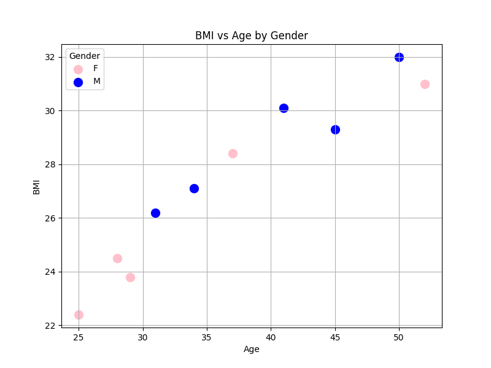
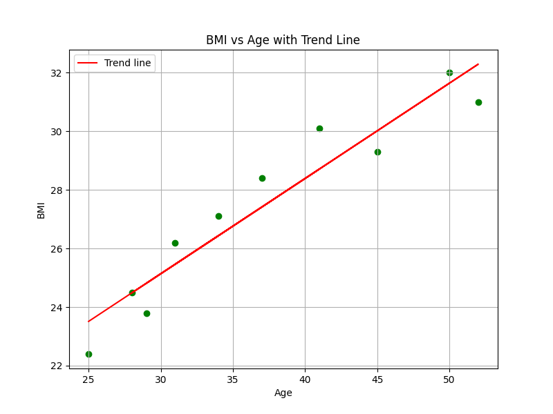

# Importing & Visualizing: BMI vs Age
**Objective:** Learn how to create a scatter plot with regression lines using Python, pandas, matplotlib, and numpy to explore patterns.

## Introduction
Understanding how to load in your own data to python and create visualizations of your data is import in finding trends. In this tutorial, we will be using the example of how BMI (Body Mass Index) changes with age in a small patient dataset. Visualizing these relationships helps identify trends, detect outliers, and generate hypotheses about health behaviors.

This guide is for those who want to practice data wrangling and visualization in Python. You’ll learn to:

 - Load and preview a dataset with pandas.

 - Plot scatter plots with matplotlib.

 - Add color coding and labels for better insights.

 - Add a regression line to a plot to show correlations in data.

### Step 1: Load the Dataset
Here is an example of how to load in your data using **pandas**. This is where we will put in our own data that we want to use for data visualization. In this step, we define a Python dictionary where each key represents a column in our dataset and the values are lists representing each row. Converting this dictionary into a DataFrame gives us a structured table that pandas can handle efficiently. Once the data is in a DataFrame, we can easily inspect, filter, and plot it.
Tips:
 - Make sure to import pandas before loading in the data.
 - Create a dictionary using keys (your column names: PatientID, Age, etc.)
 - Add your values (lists) to each key (these become the rows of your data).
 - Create a DataFrame object (named df below) that can be used for visualization.


### Sample patient dataset

```python
import pandas as pd
data = {
    'PatientID': [1, 2, 3, 4, 5, 6, 7, 8, 9, 10],
    'Age': [25, 34, 28, 45, 52, 31, 37, 41, 29, 50],
    'BMI': [22.4, 27.1, 24.5, 29.3, 31.0, 26.2, 28.4, 30.1, 23.8, 32.0],
    'Gender': ['F', 'M', 'F', 'M', 'F', 'M', 'F', 'M', 'F', 'M'],
    'Department': ['Cardiology', 'Endocrinology', 'Neurology', 'Cardiology', 
                   'Endocrinology', 'Neurology', 'Cardiology', 'Endocrinology', 'Neurology', 'Cardiology']
}

df = pd.DataFrame(data)
```
You can learn more about the `DataFrame` object in the [pandas documentation](https://pandas.pydata.org/pandas-docs/stable/reference/api/pandas.DataFrame.html).

### Step 2: Preview the Data
Before plotting, it is useful to view the data that you just imported to make sure there are no problems. Previewing the data allows us to catch issues such as missing values, typos, or unexpected data types. By checking the first few rows, we also gain a sense of the distribution of values and whether color-coding or subgroup comparisons will make sense in the scatter plot. Use the head() function to see a number of the first rows. Here is an example of how we would see the first 5 rows of our BMI vs. Age data:
```python
df.head(5)
```
| PatientID | Age | BMI  | Gender | Department    |
|-----------|-----|------|--------|---------------|
| 1         | 25  | 22.4 | F      | Cardiology    |
| 2         | 34  | 27.1 | M      | Endocrinology |
| 3         | 28  | 24.5 | F      | Neurology     |
| 4         | 45  | 29.3 | M      | Cardiology    |
| 5         | 52  | 31.0 | F      | Endocrinology |


### Step 3: Create a Scatter Plot
Now we will use our DataFrame to create a scatter plot. Scatter plots are particularly useful because each point represents an individual, making it easy to see trends, clusters, or outliers. This is where we will use **matplotlib** to help make our plot. We will plot BMI vs. Age and use colors to distinguish genders. Titles and axis labels make the plot self-explanatory, and gridlines help the viewer read exact values more easily. We use matplotlib’s `pyplot` module to create scatter plots and customize visuals. For detailed instructions and additional plotting options, see the [Matplotlib pyplot documentation](https://matplotlib.org/stable/api/pyplot_summary.html).

Tips:
 - Make sure to import matplotlib in python.
 - Decide if there are any variables that you want to distinguish by color.
 - Enhance your graph by labling your plot and axes, adding gridlines, and a legend if you decide to color code.

```python
import matplotlib.pyplot as plt

# Color code by gender
colors = {'F': 'pink', 'M': 'blue'}

# Plot
plt.figure(figsize=(8,6))
for gender in df['Gender'].unique():
    subset = df[df['Gender'] == gender]
    plt.scatter(subset['Age'], subset['BMI'], label=gender, color=colors[gender])

# Add labels, legend, and gridlines
plt.xlabel('Age')
plt.ylabel('BMI')
plt.title('BMI vs Age by Gender')
plt.legend(title='Gender')
plt.grid(True)
plt.show()
```

*Figure 1: Scatter plot showing BMI vs Age, colored by gender.*

### Step 4: Add a Regression Line
To see further correlation in date by looking at a scatterplot, we can add a regression line. Adding a regression line helps quantify relationships between variables. This will help show trends in our data. To do this, we will need to use **numpy**.
Here is the code that we would use to create a plot with a regression line:

```python
x = df['Age']
y = df['BMI']
m, b = np.polyfit(x, y, 1)

plt.figure(figsize=(8,6))
plt.scatter(x, y, color='green', s=100)
plt.plot(x, m*x + b, color='red', label=f'Trend line')
plt.xlabel('Age')
plt.ylabel('BMI')
plt.title('BMI vs Age with Trend Line')
plt.legend()
plt.grid(True)
plt.show()
```

*Figure 2: Scatter plot showing BMI vs Age, with regression line.*

The red line indicates the overall trend: as age increases, BMI tends to increase in this dataset. This simple technique can be extended to larger datasets to identify trends in different populations.

## Conclusion & Call to Action

In this tutorial, you learned how to:
 - Load and preview a dataset using pandas.
 - Visualize data using scatter plots with matplotlib.
 - Use color coding to distinguish subgroups like gender.
 - Add a regression line to highlight trends.

### Next steps for readers
If you are feeling confident, you can take it further by trying the following steps:
 - Clone this repo and run the notebook with your own dataset.
 - Try grouping by department or gender to see how patterns differ between subgroups.
 - Experiment with real-world health datasets from sources like Kaggle
 - Explore other visualization techniques such as boxplots or histograms plots to analyze BMI distributions.

Visualizations are a powerful way to understand your data at a glance. Start experimenting with your own datasets and see what correlations the data can find!
